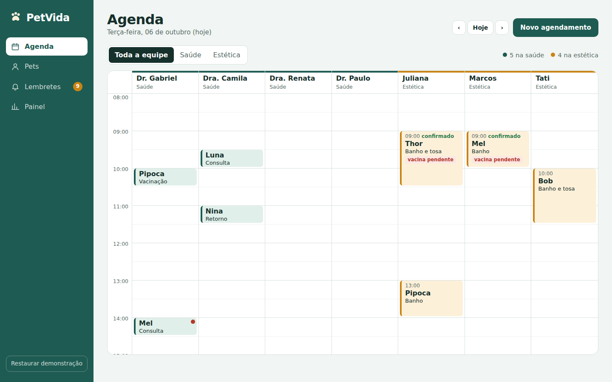
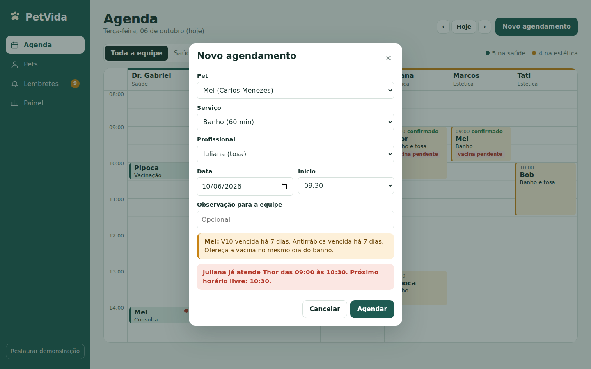
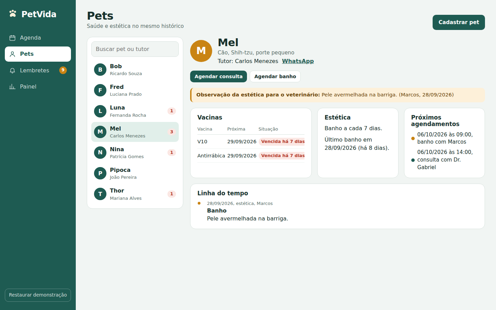
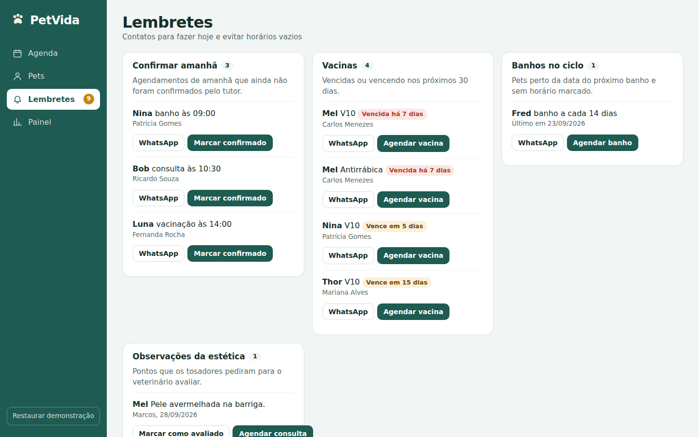
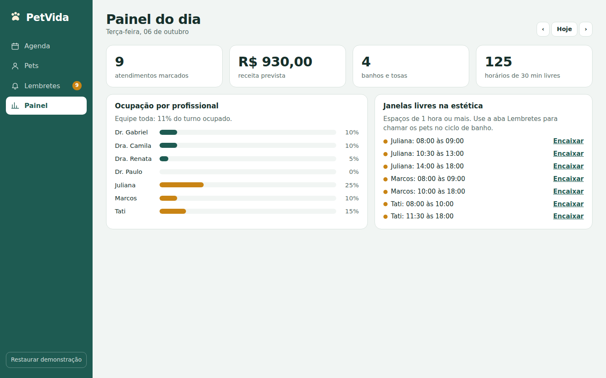
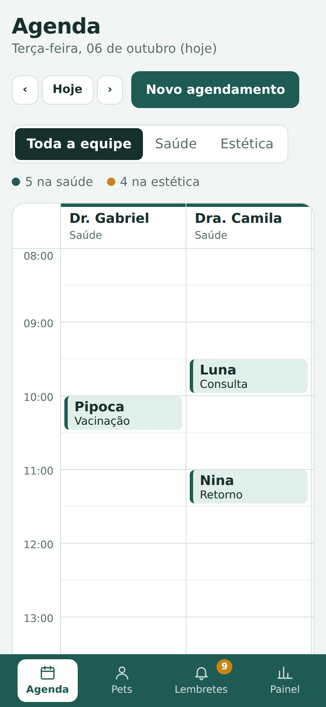
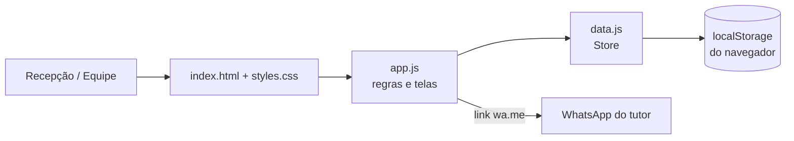

# PetVida · Agenda integrada de saúde e estética

Sistema web para a recepção da **Clínica PetVida & Estética Animal**: substitui a agenda de papel por uma agenda única de consultas e banho/tosa, com ficha do pet que junta histórico médico e estético, lembretes por WhatsApp e painel de ocupação do dia.

**Acesse o sistema:** https://rosaescalona.github.io/Trabalho_Clinica_Petvida/

> Projeto acadêmico da disciplina **Design Profissional — Produção de Portfólio & Desenvolvimento Empresarial** (Prof. Sedenilso Antonio Machado), Análise e Desenvolvimento de Sistemas, Universidade Positivo. Estudo de Caso 5.



---

## 1. Briefing

A PetVida é uma clínica veterinária de bairro (Dr. Gabriel Santos e Dra. Camila Paes, sócios em partes iguais) que também oferece banho e tosa. A equipe tem 4 veterinários, 3 tosadores e 2 recepcionistas. Todo o agendamento é feito por telefone e anotado em uma agenda de papel.

Com mais de 30 banhos por dia e consultas sobrepostas, o processo manual gera:

| Dor do cliente | Consequência |
| --- | --- |
| Choques de horário na agenda de papel | Atrasos e tutores insatisfeitos |
| Tutores esquecem banho, vacina e retorno | Horários vazios e perda de receita |
| Histórico médico em pastas físicas | Recepção perde minutos procurando fichas |
| Sem lembretes de retornos preventivos | Clínica perde a recorrência dos clientes |

**Oportunidade:** as redes de pet shop da região oferecem agendamento simples, mas a PetVida tem a confiança médica dos tutores. O diferencial é integrar o cuidado estético ao histórico de saúde do animal.

## 2. Decisão de design: por que um sistema web?

Foram avaliadas três opções:

| Opção | Avaliação |
| --- | --- |
| Site institucional | Não resolve a dor. O problema não é divulgação, é a operação interna. |
| Aplicativo para o tutor | Depende de o tutor baixar e usar. A agenda continuaria bagunçada na recepção. |
| **Sistema web (dashboard) responsivo** | **Escolhido.** Ataca a origem do caos: a agenda da recepção. |

Motivos da escolha:

1. **Quem sofre a dor é a recepção.** As duas recepcionistas precisam de uma ferramenta no balcão, não de mais um canal de entrada.
2. **Sem instalação.** Abre no computador da recepção, no tablet da tosa ou no celular do veterinário.
3. **O tutor já usa WhatsApp.** Os lembretes saem pelo WhatsApp com a mensagem pronta, sem obrigar o cliente a baixar nada.
4. **Base para evoluir.** O app do tutor entra como fase 2, consumindo a mesma agenda (ver seção 8).

## 3. Funcionalidades

| Funcionalidade | Dor que resolve |
| --- | --- |
| **Agenda unificada** por profissional, com cores por área (verde = saúde, amarelo = estética) | Fim da agenda de papel |
| **Bloqueio de choques**: impede marcar o mesmo profissional ou o mesmo pet em horários sobrepostos e sugere o próximo horário livre | Choques de horário |
| **Ficha do pet** com vacinas, ciclo de banho e linha do tempo única de saúde + estética | Histórico em pastas físicas |
| **Integração saúde ↔ estética**: ao agendar banho, o sistema avisa se há vacina vencida; o tosador pode pedir avaliação do veterinário ao concluir o banho | Diferencial competitivo da clínica |
| **Lembretes**: confirmar agendamentos de amanhã, vacinas vencendo, banhos no ciclo e observações da estética, cada um com botão de WhatsApp com mensagem pronta | Esquecimento e horários vazios |
| **Painel do dia**: atendimentos, receita prevista, ocupação por profissional e janelas livres na estética | Previsibilidade de caixa |

## 4. Telas

| Agenda com conflito bloqueado | Ficha integrada do pet |
| --- | --- |
|  |  |

| Lembretes | Painel do dia |
| --- | --- |
|  |  |

Versão celular:



## 5. Arquitetura

Aplicação **front-end estática** (HTML, CSS e JavaScript puro), sem framework e sem etapa de build. Publicada no **GitHub Pages**.

```
petvida-clinica/
├── index.html          # Estrutura das telas e modais
├── css/
│   └── styles.css      # Identidade visual, layout e responsividade
├── js/
│   ├── data.js         # Camada de dados: datas, dados de demonstração, persistência
│   └── app.js          # Regras de negócio, renderização das telas e eventos
├── docs/telas/         # Capturas de tela usadas neste README
├── .gitignore
├── LICENSE
└── README.md
```



**Modelo de dados** (salvo em `localStorage`, chave `petvida:v1`):

- `equipe`: profissionais e sua área (`saude` ou `estetica`)
- `servicos`: consulta, retorno, vacinação, cirurgia, banho, banho e tosa, tosa higiênica (duração e preço)
- `pets`: dados do pet, tutor, ciclo de banho, vacinas e histórico
- `agendamentos`: pet, serviço, profissional, data, início, duração e situação
- `alertas`: observações da estética para o veterinário

**Principais regras de negócio** (`js/app.js`):

- `verificarConflito()`: bloqueia sobreposição por profissional e por pet, e atendimentos que terminam após as 18h.
- `proximoLivre()`: sugere o próximo horário disponível quando há conflito.
- `statusVacina()`: classifica vacinas em vencida, a vencer (30 dias) ou em dia.
- `calcularLembretes()`: monta a lista de contatos do dia.
- `janelasLivres()`: calcula espaços ociosos para encaixe.

## 6. Identidade visual

| Elemento | Escolha | Motivo |
| --- | --- | --- |
| Verde clínico `#1E5B52` | Saúde | Transmite confiança médica, o ponto forte da PetVida |
| Amarelo-sol `#C98414` | Estética | Diferencia banho e tosa à primeira vista na agenda |
| Vermelho `#B3392A` | Pendências | Reservado para vacina vencida, conflito e falta |
| Atkinson Hyperlegible | Texto | Fonte criada para máxima legibilidade, ideal para uso rápido no balcão |
| Bricolage Grotesque | Títulos | Personalidade amigável, de clínica de bairro |

A cor nunca é decorativa: ela sempre indica a área do serviço.

## 7. Como executar

**Online:** acesse o link do GitHub Pages no topo deste README.

**Localmente:**

```bash
git clone https://github.com/SEU-USUARIO/petvida-clinica.git
cd petvida-clinica
```

Depois, abra o `index.html` no navegador. Se preferir um servidor local:

```bash
python -m http.server 8000
# acesse http://localhost:8000
```

O sistema já abre com dados de demonstração (datas sempre relativas ao dia atual). O botão **Restaurar demonstração** volta ao estado inicial.

**Roteiro sugerido para avaliar:**

1. Na **Agenda**, clique em um horário vazio e tente marcar a Mel com a Juliana às 09:30: o sistema bloqueia o conflito e sugere outro horário.
2. Repare no aviso de **vacina pendente** ao agendar banho para a Mel.
3. Abra o banho da Mel, clique em **Concluir atendimento** e marque "Pedir avaliação do veterinário".
4. Veja a observação aparecer na **ficha do pet** e em **Lembretes**.
5. Em **Painel**, confira ocupação e janelas livres e use **Encaixar**.

**Publicar no GitHub Pages:** Settings → Pages → Source: *Deploy from a branch* → Branch `main`, pasta `/ (root)`.

## 8. Segurança e próximos passos

**Segurança de credenciais:** o projeto não usa nenhuma senha, token ou chave de API. Os lembretes usam links públicos `wa.me`, que não exigem autenticação. O `.gitignore` já bloqueia arquivos `.env` e chaves caso o projeto evolua.

**Limitações conscientes do protótipo:** os dados ficam no navegador de cada máquina, então ainda não há sincronização entre computadores.

**Fase 2 (evolução proposta):**

- Back-end com banco de dados (ex.: Node.js + PostgreSQL ou Supabase) para sincronizar recepção, tosa e consultórios.
- Login por perfil (recepção, veterinário, tosador).
- Envio automático pelo WhatsApp Business API, com tokens em variáveis de ambiente.
- App/portal do tutor para autoagendamento e acesso à carteira de vacinação.

## Autor

**Lourenço da Silva Carneiro Terrana**, estudante de Análise e Desenvolvimento de Sistemas na Universidade Positivo.

## Licença

Distribuído sob a licença MIT. Veja o arquivo [LICENSE](LICENSE).
